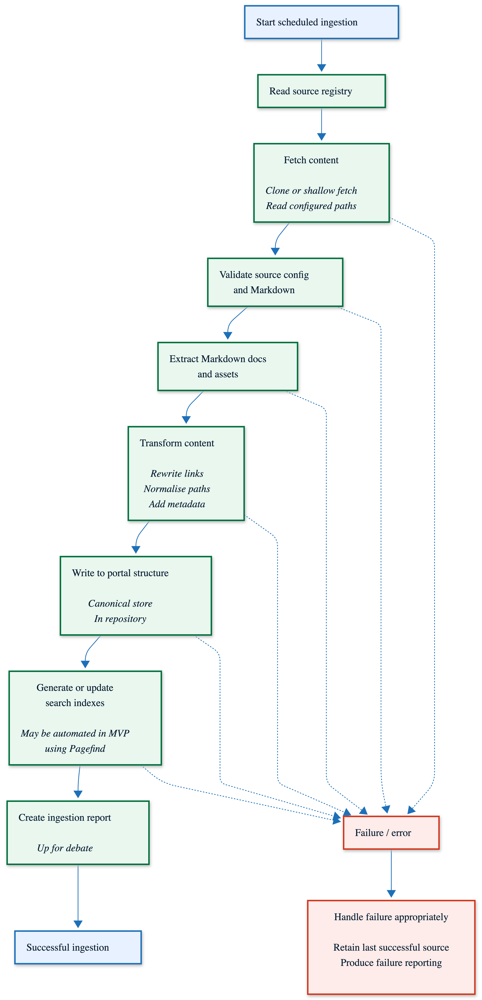

## Architecture diagrams

Architecture diagrams are stored as PNG files so they render reliably in GitHub, IDEs, and documentation tooling.

Where available, the Mermaid source for each diagram is also stored alongside the PNG in the same directory. The Mermaid files are kept for reference and future
editing, but they are not currently used as part of the build process.

To update a diagram:

1. Open the relevant `.mmd` file.
2. Copy the Mermaid source into the Mermaid Live Editor.
3. Make the required changes.
4. Export the updated diagram as a PNG.
5. Replace the existing PNG in the repository.
6. Commit both the updated `.mmd` source and the updated `.png`.

For example:

```text
docs/
  architecture/
    ingestion-mvp.md
    diagrams/
      ingestion-mvp.mmd
      ingestion-mvp.png
```

The Markdown documentation should embed the PNG:

```md

```

In a future iteration, we may add a build step that automatically generates PNG files from the committed Mermaid source files. This would make the `.mmd` files
the source of truth and reduce the need to export diagrams manually.
