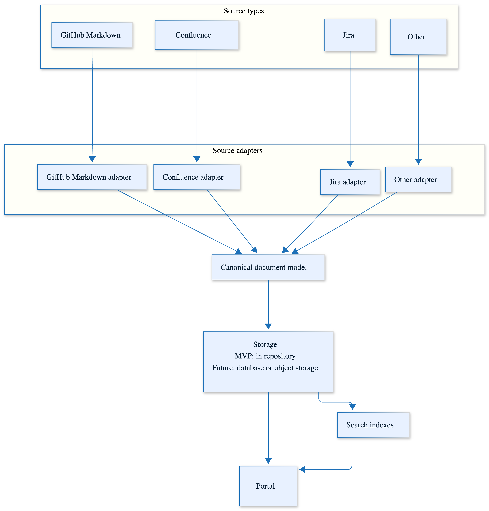

# Possible Future Architecture

## Overview

This architecture describes a possible evolution from the MVP ingestion model towards a broader documentation platform that can support multiple source types,
multiple source adapters, a shared canonical document model, richer storage, and improved search and filtering.

The intent is to avoid coupling the portal directly to the shape of each upstream source. Instead, each source adapter should transform its source content into
a common document model before the content is stored, indexed, and surfaced through the portal.

## Architecture diagram



## Architecture approach

The future architecture introduces a separation between:

- source types;
- source adapters;
- the canonical document model;
- storage;
- indexing;
- portal rendering.

This allows the portal to support additional sources over time without requiring the portal itself to understand the implementation details of each source
system.

## Source types

Initial source types may include:

- GitHub Markdown;
- Confluence;
- Jira;
- other sources to be defined later.

GitHub Markdown remains the MVP source type. Other GitHub content types may be considered later if they are relevant.

## Source adapters

Each source type should have a dedicated adapter responsible for retrieving and normalising content from that source.

Potential adapters include:

- GitHub Markdown adapter;
- Confluence adapter;
- Jira adapter;
- other adapters to be defined later.

Each adapter should output content in the same canonical document shape. This keeps source-specific complexity outside the portal rendering layer.

## Canonical document model

The canonical document model provides a single source of truth for how processed documentation is represented inside the platform.

Defining this model enables the portal to treat content consistently regardless of whether it originated from GitHub, Confluence, Jira, or another source.

Example model:

```ts
type CanonicalDocument = {
  id: string;
  sourceId: string;
  sourceType: 'github' | 'confluence' | 'jira';
  title: string;
  body: string;
  contentType: 'markdown' | 'html';
  originalUrl: string;
  portalPath: string;
  owner?: string;
  tags?: string[];
  lastModified?: string;
  version?: string;
  visibility: 'public' | 'internal';
};
```

## Storage

For the MVP, content can be stored in the portal repository.

Future storage options may include:

- a database;
- object storage;
- S3-compatible storage;
- a hybrid model where content metadata and content bodies are stored separately.

The storage approach does not need to be solved immediately. The key point is to avoid designing the portal so tightly around repository-based storage that
later migration becomes difficult.

## Search indexes

Search indexes are generated from the canonical document model.

For the MVP, static search may be sufficient, possibly using Pagefind. Later phases may require richer search capabilities, including filtering, metadata
search, permissions-aware search, or AI-assisted discovery.

## Portal

The portal consumes the stored canonical content and search indexes.

The portal should not need to know whether a document originally came from GitHub, Confluence, Jira, or another source. It should only need to understand the
canonical document model and associated metadata.

## Phased evolution

| Phase         | Scope                                                                                                                                                                                                                                |
| ------------- | ------------------------------------------------------------------------------------------------------------------------------------------------------------------------------------------------------------------------------------ |
| Phase 1 — MVP | GitHub-only Markdown ingestion, scheduled ingestion, static search, static website, content stored in the portal repository, sources centralised in the portal repository, surfacing latest versions only, logging to be considered. |
| Phase 2       | Possible repository-owned `portal.yaml`, possible webhook-triggered ingestion, metadata enrichment.                                                                                                                                  |
| Phase 3       | Confluence adapter, Jira adapter, object storage or database if required.                                                                                                                                                            |
| Phase 4       | Enriched search and filtering, AI-assisted discovery.                                                                                                                                                                                |

## Key design principle

The key design principle is to separate source-specific ingestion from portal rendering.

Source adapters should absorb source-specific complexity. The portal should consume a consistent canonical document model.
