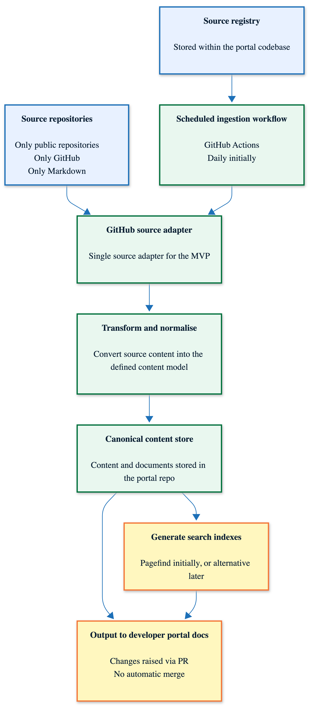

# MVP Architecture

## Overview

The MVP ingests Markdown documentation from approved public GitHub repositories, transforms it into a defined content model, stores the normalised content in
the portal repository, generates a search index, and publishes the output to the developer portal.

The initial implementation is intentionally simple:

- source repositories are public GitHub repositories only;
- source content is Markdown only;
- source configuration is stored inside the portal codebase;
- ingestion is scheduled through GitHub Actions;
- content changes are raised through pull requests rather than automatically merged.

## Architecture flow



The editable diagram source is available here:

[View Mermaid source](./diagrams/mvp-architecture.mmd)

## Components

### Source repositories

Source repositories are the upstream repositories that contain documentation to be surfaced in the developer portal.

For the MVP, these are constrained to:

- public repositories only;
- GitHub repositories only;
- Markdown content only.

### Source registry

The source registry defines which repositories should be ingested.

For the MVP, the registry is stored inside the portal codebase. This allows source configuration to be version-controlled and reviewed through the same pull
request process as the rest of the portal.

The registry should include enough information to identify each source and control how it is ingested, for example:

- source ID;
- repository URL;
- display name;
- documentation path;
- owning team or Slack channel;
- category or lifecycle grouping;
- ingestion mode.

### Scheduled ingestion workflow

A scheduled GitHub Actions workflow runs the ingestion process.

Initially, this can run daily. The workflow reads the source registry, fetches content from each configured source repository, transforms the content, and
updates the canonical content store.

The workflow should create a pull request when content changes are detected. This avoids silently changing the developer portal and gives maintainers a review
point before updates are merged.

### GitHub source adapter

The GitHub source adapter retrieves documentation from configured GitHub repositories.

For the MVP, only one adapter is required. This keeps the implementation focused while allowing the architecture to support additional adapters later if
required.

### Transform and normalise

The transform step converts source documentation into the portal’s defined content model.

Typical responsibilities may include:

- reading Markdown files;
- applying frontmatter;
- normalising links;
- copying or rewriting asset references;
- adding source metadata;
- mapping content into portal navigation;
- validating required fields;
- excluding unsupported content.

### Canonical content store

The canonical content store is the normalised version of the documentation used by the developer portal.

The portal should render from this canonical structure rather than directly from source repositories.

This creates a clean separation between:

- upstream source repositories;
- ingestion and transformation logic;
- the content structure used by the portal itself.

### Search index generation

Search indexes are generated from the canonical content store.

For the MVP, Pagefind is a suitable lightweight option because it works well with static sites and does not require a separate hosted search service.

### Developer portal output

The final output is rendered as developer portal documentation.

Content changes should be raised through pull requests rather than automatically merged. This provides a review step and reduces the risk of broken navigation,
poor-quality content, or unexpected changes being published automatically.

## Possible repository structure

```text
content/
  documents/
    github/
      source-a/
      source-b/

  metadata/
    sources.json
    ingestion-runs.json

public/
  search-index/

scripts/
  ingest/
```

## Key MVP constraints

The MVP deliberately avoids solving every possible documentation ingestion scenario.

The initial constraints are:

- GitHub only;
- public repositories only;
- Markdown only;
- scheduled ingestion only;
- source registry managed in the portal codebase;
- one source adapter;
- pull-request-based publication flow;
- no automatic merging of detected content changes.

## Future considerations

Areas that may need to evolve after the MVP include:

- support for private or internal repositories;
- additional source adapters;
- richer metadata and ownership models;
- validation of source content before ingestion;
- automated quality checks;
- support for non-Markdown content;
- permissions-aware search;
- event-based ingestion rather than scheduled ingestion;
- self-service source registration;
- clearer publishing and approval workflows.
